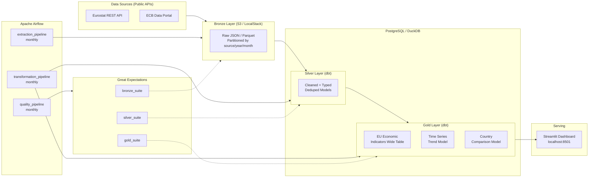
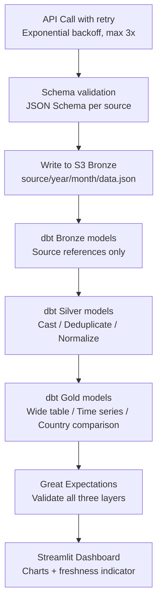

# DataFlow EU

[](https://github.com/Austinmff/dataflow-eu/actions/workflows/ci.yml)
[](https://www.python.org/)
[](https://www.getdbt.com/)
[](https://airflow.apache.org/)
[](LICENSE)

**Production-grade batch data pipeline ingesting European economic indicators from public APIs, transforming them through a Medallion Architecture with dbt, orchestrating with Apache Airflow, and serving insights via a Streamlit dashboard.**

> Built as a portfolio project targeting Data Engineer roles in Portugal and Spain.
> Stack: Airflow + dbt + PostgreSQL + LocalStack S3 + Great Expectations + GitHub Actions.
> Runs entirely on Docker Compose — one command.

---

## Architecture



---

## Tech Stack

| Category        | Tool / Version          | Why                                               |
|-----------------|-------------------------|---------------------------------------------------|
| Orchestration   | Apache Airflow 2.9+     | Industry standard. Most requested in EU postings. |
| Transformation  | dbt Core 1.8+           | Modern ELT standard. Required in 80%+ of DE roles.|
| Language        | Python 3.11+            | Extractors, tests, quality checks, utilities.     |
| Warehouse       | PostgreSQL 16 / DuckDB  | Postgres for production; DuckDB for fast local dev.|
| Data Quality    | Great Expectations      | Automated expectation suites with HTML data docs. |
| Storage         | AWS S3 / LocalStack     | Cloud-native Bronze layer, locally simulated.     |
| Containerisation| Docker Compose          | Full reproducibility. One command to run stack.   |
| CI/CD           | GitHub Actions          | Lint, test, validate on every PR.                 |
| Dashboard       | Streamlit               | Python-native, fast to build, production-ready.   |

---

## Quick Start

> **Prerequisites:** Docker Desktop with WSL2 integration, Python 3.11+, Git.

```bash
# 1. Clone the repository
git clone https://github.com/Austinmff/dataflow-eu.git
cd dataflow-eu

# 2. First-time setup (creates .env, generates keys, installs dev deps)
make setup

# 3. Start the full stack
make run
```

After ~2 minutes:

| Service      | URL                          | Credentials       |
|--------------|------------------------------|-------------------|
| Airflow UI   | http://localhost:8080        | admin / admin     |
| PostgreSQL   | localhost:5432               | dataflow / dataflow|
| LocalStack   | http://localhost:4566        | —                 |
| Dashboard    | http://localhost:8501        | (run `make dashboard`) |

```bash
# 4. Run all tests
make test

# 5. Stop the stack
make stop
```

---


## Project Structure

dataflow-eu/
├── .github/workflows/       # GitHub Actions CI/CD
├── dags/                    # Airflow DAG definitions
│   ├── extraction_dag.py    # Ingest raw data from APIs → S3
│   ├── transformation_dag.py # Trigger dbt Bronze/Silver/Gold runs
│   └── quality_dag.py       # Run Great Expectations suites
├── extractors/              # Python API clients (one module per source)
│   ├── eurostat.py
│   └── ecb.py
├── dbt/                     # dbt project
│   ├── models/
│   │   ├── bronze/          # Source references (no transformation)
│   │   ├── silver/          # Cleaned, typed, deduplicated
│   │   └── gold/            # Business-ready aggregations & KPIs
│   ├── tests/               # Custom dbt data tests
│   └── macros/              # Reusable dbt macros
├── expectations/            # Great Expectations suites per layer
├── dashboard/               # Streamlit application
├── docs/
│   ├── adr/                 # Architecture Decision Records
│   ├── dbt/                 # Generated dbt docs (static site)
│   ├── data-quality/        # Generated GE HTML Data Docs
│   └── runbook.md           # Operational runbook
├── tests/
│   ├── unit/                # pytest unit tests (mocked AWS)
│   └── integration/         # pytest integration tests (live stack)
├── scripts/                 # Init scripts for Docker services
├── docker-compose.yml       # Full local stack definition
├── Makefile                 # Developer commands (commands list below)
├── pyproject.toml           # Python tooling config (ruff, pytest)
└── .env.example             # Required environment variables template

---

## Data Sources

| Source              | Datasets                                                                  | Update Frequency |
|---------------------|---------------------------------------------------------------------------|------------------|
| Eurostat REST API   | GDP per capita (`nama_10_pc`), Unemployment (`une_rt_m`), Inflation (`prc_hicp_manr`), Population (`demo_pjan`) | Monthly / Annual |
| ECB Data Portal     | EUR exchange rates, Interest rates (MRO), M3 Money Supply                | Daily / Monthly  |

All sources are publicly available, free to use, and require no API key.

---

## Pipeline Overview



---

## Makefile Reference

| Command           | Description                                              |
|-------------------|----------------------------------------------------------|
| `make setup`      | First-time setup: copy `.env`, generate keys, install deps |
| `make run`        | Start Airflow + PostgreSQL + LocalStack                  |
| `make dashboard`  | Start stack including Streamlit dashboard                |
| `make stop`       | Stop all containers                                      |
| `make restart`    | Full restart (stop + run)                                |
| `make clean`      | Remove all containers and volumes ⚠️ deletes data        |
| `make test`       | Run pytest + dbt test                                    |
| `make test-unit`  | Run unit tests only                                      |
| `make lint`       | Run ruff + sqlfluff + pre-commit                         |
| `make format`     | Auto-format Python with ruff                             |
| `make dbt-run`    | Execute all dbt models                                   |
| `make dbt-test`   | Run all dbt tests                                        |
| `make dbt-docs`   | Generate and serve dbt docs at localhost:8000            |
| `make logs`       | Tail all service logs                                    |
| `make s3-ls`      | List Bronze S3 bucket contents                           |
| `make backfill`   | Manual Airflow backfill (set DAG, START, END)            |

---

## Development

### Adding a new data source

1. Create `extractors/<source_name>.py` implementing the `BaseExtractor` interface.
2. Add the corresponding JSON Schema file at `extractors/schemas/<source_name>.json`.
3. Create a Bronze dbt model at `dbt/models/bronze/bronze_<source_name>.sql`.
4. Add Silver and Gold models as needed.
5. Add a new expectation suite at `expectations/bronze/<source_name>_suite.json`.
6. Register the extractor task in `dags/extraction_dag.py`.
7. Write unit tests in `tests/unit/test_<source_name>.py`.

### Running tests manually

```bash
# All tests
make test

# Unit only (no running Docker required)
make test-unit

# Integration only (requires make run first)
make test-integration

# Single test file
pytest tests/unit/test_eurostat.py -v
```

### Backfilling historical data

```bash
make backfill DAG=extraction_pipeline START=2019-01-01 END=2024-12-31
```

---

## Architecture Decisions

| ADR                                                       | Decision                                              |
|-----------------------------------------------------------|-------------------------------------------------------|
| [ADR-001](docs/adr/ADR-001-warehouse-choice.md)           | DuckDB for local dev, PostgreSQL for production       |
| [ADR-002](docs/adr/ADR-002-dbt-model-structure.md)        | Medallion (Bronze/Silver/Gold) over subject-area      |
| [ADR-003](docs/adr/ADR-003-airflow-taskflow-api.md)       | TaskFlow API over classic Airflow operators           |
| [ADR-004](docs/adr/ADR-004-dashboard-streamlit.md)        | Streamlit over Evidence.dev / Metabase / Looker Studio|

## Operations

- [**Runbook**](docs/runbook.md) — what to do when a pipeline fails, organized by symptom
- [dbt docs](https://austinmff.github.io/dataflow-eu/) — auto-generated model lineage and column documentation (GitHub Pages)
- [Data quality reports](docs/data-quality/index.html) — generated by `python scripts/run_quality_checks.py`

## Testing & Quality

- **93% test coverage** on extractors (`pytest tests/unit/ -v --cov=extractors`)
- 28 Great Expectations checks across Bronze/Silver/Gold layers
- CI runs lint (ruff + sqlfluff), unit tests, dbt compile, and Docker build on every push

---

## License

MIT © 2026 Austin Manoel Farias Ferreira — [github.com/Austinmff](https://github.com/Austinmff)