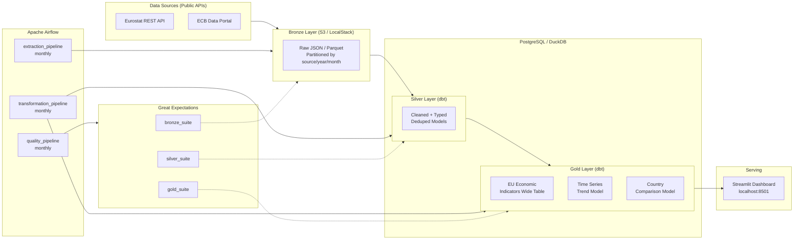

# DataFlow EU

[](https://github.com/Austinmff/dataflow-eu/actions/workflows/ci.yml)
[](https://www.python.org/)
[](https://www.getdbt.com/)
[](https://airflow.apache.org/)
[](LICENSE)

**Production-grade batch data pipeline ingesting European economic indicators from public APIs, transforming them through a Medallion Architecture with dbt, orchestrating with Apache Airflow, and serving insights via a Streamlit dashboard.**

> Built as a portfolio project targeting Data Engineer roles in Portugal and Spain.
> Stack: Airflow + dbt + PostgreSQL + LocalStack S3 + Great Expectations + GitHub Actions.
> Runs entirely on Docker Compose — one command.

---

## Architecture



---

## Tech Stack

| Category        | Tool / Version          | Why                                               |
|-----------------|-------------------------|---------------------------------------------------|
| Orchestration   | Apache Airflow 2.9+     | Industry standard. Most requested in EU postings. |
| Transformation  | dbt Core 1.8+           | Modern ELT standard. Required in 80%+ of DE roles.|
| Language        | Python 3.11+            | Extractors, tests, quality checks, utilities.     |
| Warehouse       | PostgreSQL 16 / DuckDB  | Postgres for production; DuckDB for fast local dev.|
| Data Quality    | Great Expectations      | Automated expectation suites with HTML data docs. |
| Storage         | AWS S3 / LocalStack     | Cloud-native Bronze layer, locally simulated.     |
| Containerisation| Docker Compose          | Full reproducibility. One command to run stack.   |
| CI/CD           | GitHub Actions          | Lint, test, validate on every PR.                 |
| Dashboard       | Streamlit               | Python-native, fast to build, production-ready.   |

---

## Quick Start

> **Prerequisites:** Docker Desktop with WSL2 integration, Python 3.11+, Git.

```bash
# 1. Clone the repository
git clone https://github.com/Austinmff/dataflow-eu.git
cd dataflow-eu

# 2. First-time setup (creates .env, generates keys, installs dev deps)
make setup

# 3. Start the full stack
make run
```

After ~2 minutes:

| Service      | URL                          | Credentials       |
|--------------|------------------------------|-------------------|
| Airflow UI   | http://localhost:8080        | admin / admin     |
| PostgreSQL   | localhost:5432               | dataflow / dataflow|
| LocalStack   | http://localhost:4566        | —                 |
| Dashboard    | http://localhost:8501        | (run `make dashboard`) |

```bash
# 4. Run all tests
make test

# 5. Stop the stack
make stop
```

---

## Project Structure